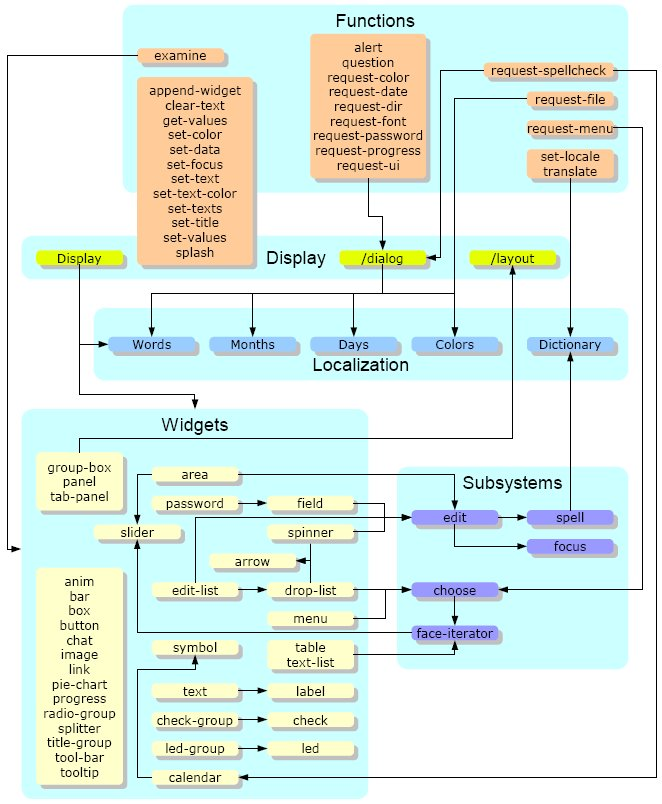

# User Guide

## Introduction

This document describes the use and operation of the RebGUI `display` function and associated subsystems and specification rules. With this knowledge you will be able to specify the widgets and attributes that are required to render a GUI window.

### Compatibility

RebGUI requires Rebol/View 1.3.2 or higher to work. Older versions of View are not supported.

### Running the examples

The examples given in this guide are designed to be run from a script or the console. To run them from a script use *Notepad* or similar to create a file with a `.r` suffix and enter the following:

	Rebol []

	do %rebgui.r

	display "Example" [
		text "Hello World!"
	]

	do-events

Then save the file and double-click (under Windows) to run it. In the examples in this guide replace the main body of the code (the line after that beginning with "display") with the particular example code you wish to try.

You can also run these examples from a Rebol/View console:

	>> do view-root/public/www.dobeash.com/RebGUI/rebgui.r
	>> display ...
	>> do-events

Be sure to follow each example with a:

	>> do-events

which starts the event loop. Closing the display will return you to the console. If you press *Esc* you will exit the event loop from which you can either type `do-events` to start the event loop again or:

	>> unview

to remove the display.

> You may find the first method, running the examples as a script, easier if you are not familiar with console environments like DOS or the Unix shell.

### Glossary

RebGUI adopts the terminology used by Rebol/View, but uses different terminology to that of VID to avoid ambiguity. This was done, for example, to avoid having to refer to *VID style facets* as opposed to *RebGUI style facets*.

View/VID    | View/RebGUI      | Description
----------- | ---------------- | -----------
Face        | Face             | A Rebol/View graphical object with facets that determine its look and feel. A face may contain multiple sub-faces.
Facet       | Facet            | One of the 25 words used to describe a Rebol/View face, including such things as size, color, and feel.
Feel        | Feel             | The facet of a face that defines how it reacts to user input and events. The feel facet is an object that may define up to four feel functions: Redraw, Over, Engage, and Detect.
Style       | Widget           | A face template with predefined facets and feels that determine its default appearance and behavior. Complex widgets may have facets specific to themselves.
Style Facet | Widget Attribute | A facet / attribute that is commonly used to set and / or change this default appearance and / or behavior.
Window      | Window           | An OS window containing one or more widgets.

### Overview

RebGUI functionality can be split into five broad groups. The following diagram depicts the relationship between each group and the relationship between items within a group.

#### Functions

RebGUI includes requestor, accessor and general functions to handle requests for user input, manipulation of widget attributes, and miscellaneous tasks respectively.

#### Display

The `display` function is the engine that drives a RebGUI application. It uses, and is used by, items in the other groups to render and manage windows based upon simple block specifications.

#### Localization

The localization system enables RebGUI to make use of languages other than English with little effort.

#### Widgets

Widgets are, by and large, stand-alone objects with a well defined look and feel. They are used by the `display` function to construct windows.

#### Subsystems

A number of RebGUI subsystems handle common widget functionality, facilitating easier widget creation and maintenance.

## Display Function

The `display` function combines the basic functionality of the `view` and `layout` functions to make and render faces from a widget specification.

	USAGE:
		DISPLAY title spec /dialog /maximize /parent /position offset /min-size size /close closer

	DESCRIPTION:
		Displays widgets in a centered window with a title.

	ARGUMENTS:
		title [string!]                 -- Window title
		spec [block!]                   -- Block of widgets, attributes and keywords

	REFINEMENTS:
		/dialog                         -- Displays widgets in a modal popup window with /parent option
		/maximize                       -- Maximize window
		/parent                         -- Force parent to be last window (default is first)
		/position                       -- Use an alternative positioning scheme
			offset [pair! word! block!] -- Offset pair or one or more of 'left 'right 'top 'bottom 'first 'second
		/min-size                       -- Specify a minimum OS window resize size
			size [pair!]                -- Minimum display size (including window border/title)
		/close                          -- Handle window close event
			closer [block!]             -- The close handler block

### Refinements

#### Dialog

Display widgets in a modal popup window and suspend the current event loop until `hide-popup`. Used primarily by requestor functions.

	button "Dialog" [
		display/dialog "Dialog" [button "Done" [hide-popup]]
	]

In addition to this modal behavior (i.e. exclusive focus), the suspension of the current event loop allows code like the following to *wait* and act upon a response:

	button "Color" [
		if var: request-color [print "Got a color"]
	]

#### Maximize

Maximize the window when displayed.

	display/maximize "Example" [area #HW]

#### Parent

By default a new display is *anchored* to the first (or main) display. This ensures that the main display cannot be bought into the foreground to obscure its child displays.

	display "Example1" [button "One" 100 [
		display "Example2" [button "Two" 75 [
			display "Example3" [button "Three" 50]
		]]]
	]

Clicking button **One** will open the second display whilst clicking button **Two** will open the third. Now try clicking on each of the windows in turn and note how the first display stays in the background. Also note that clicking the first display's close button will close **all** its child displays.

Now contrast this with the use of the parent option in the third display:

	display "Example1" [button "One" 100 [
		display "Example2" [button "Two" 75 [
			display/parent "Example3" [button "Three" 50]
		]]]
	]

The third display is anchored to the second and will be closed when the second is closed.

#### Position

Specify an alternate window position. Specify an absolute window offset as follows:

	display/position "Test" [text "Absolute window offset."] 100x100

or one of `'left`, `'right`, `'top` or `'bottom` as follows:

	display/position "Test" [text "Centered in left half of window."] 'left

Positions can also be combined like this:

	display/position "Test" [text "Top left of window."] [top left]

The `'first` and `'second` words allow orientation-neutral positioning whereby `'first` and `'second` are substituted for `'left` and `'right` on screens with a greater width than height, and `'top` and `'bottom` when the reverse holds true.

#### Min-Size

Specify a minimum OS window resize value.

	display/min-size "Example" [area #HW] 320x240

The `min-size` limit will only be enforced upon a window resize, and the size is inclusive of an OS specific number of border and title pixels. Also note that if **any** widgets are resizeable (`#H` and `#W`) and `min-size` has not been specified then RebGUI will assign a default value equal to the initial window size.

#### Close

Handle window close event. Adding a close handler is as simple as:

	display/close "Example" [
		text "Closing the window will change its title."
	] [show-title face "Closing ..." wait 1 true]

The processing logic is:

1. If a widget has focus, remove it (ignoring its `on-unfocus` action if any).
2. If a `close` action is defined, call it and proceed no further if it returns `false`.
3. If this display is the first and there are more than one open then prompt to close all windows (i.e. quit the application); proceed no further on `false`.
4. Close the window.

Your close handler must return `true` for the close to proceed. Returning `false` will prevent the window from closing, as in the following example:

	display/close "Example" [
		text "Closing the window will prompt to confirm."
	] [question "Close?"]

### Splash Function

The `splash` function can be used at the start of a program to display a *splash* screen.

	USAGE:
		SPLASH spec

	DESCRIPTION:
		Displays a centered splash screen for one or more seconds.

	ARGUMENTS:
		spec [block!]                   -- The face spec to display

There is no need to *explicitly* `unview` the splash screen as the first use of the `display` function will do that automatically.

## Widget Specification

The widget specification block consists of one or more widgets and their attributes. As a simple example:

	text 80 sky "Click me" [print "Clicked"]
	return
	box 80x40 white

### Attribute Summary

Each widget has the following attributes (`tip` is specific to RebGUI) that may be modified. Refer to the [Rebol/View Graphic System Reference](http://www.Rebol.com/docs/view-system.html#section-2.2) for a complete description of each View facet.

Attribute | Type              | Specification
--------- | ----------------- | ---------------------------------
offset    | pair!             | at `pair!`
size      | pair!             | `integer!` `pair!`
span      | issue!            | `issue!`
text      | string!           | `string!`
color     | tuple!            | `word!` `tuple!`
image     | image!            | `file!` `image!`
effect    | word! or block!   | effect `block!` effect `word!`
data      | any-type!         | data `any-type!`
edge      | block!            | edge `block!`
font      | block!            | font `block!`
para      | block!            | para `block!`
feel      | block!            | feel `block!`
rate      | integer! or time! | rate `integer!` rate `time!`
show?     | logic!            | `logic!`
options   | block!            | options `block!`
action    | object!           | on-click `block!` on-alt-click `block!` on-dbl-click `block!` on-focus `block!` on-unfocus `block!` on-over `block!` on-away `block!` on-key `block!` on-edit `block!` on-scroll `block!` on-resize `block!`
tip       | string!           | tip `string!`

#### span Directives

To enable widget resizing, just add the `span` attribute as indicated below.

	area #HW
	area #HX

The attribute value is an `issue!` of one to seven characters where each character has the following meaning:

When the display is initially rendered:

- `#L` Lateral. Align right-hand edge of widget with display (or grouping widget) edge.
- `#V` Vertical. Align base edge of widget with display (or grouping widget) edge.
- `#O` Offset (lateral). Move the widget to align with the right-hand display (or grouping widget) edge.

When the display is resized:

- `#H` Height. Stretch/shrink the widget vertically.
- `#W` Width. Stretch/shrink the widget horizontally.
- `#X` X-Offset. Move the widget horizontally.
- `#Y` Y-Offset. Move the widget vertically.

By convention these codes are written in upper-case.

The `#L` and `#V` directives reduce the need for cumbersome sizing calculations, as follows:

	area area area
	return
	area area #LV
	return
	area

The `#O` directive is used as follows:

	area #O
	return
	area
	area

All seven directives work as expected within a grouping widget as follows:

	group-box "Example" #HW data [
		after 2
		text "Some text"
		field #LHW
		text "Some more text" #Y
		field #WY
	]

#### tip String

Tooltips can be added to any widget as follows:

	text "Text" tip "A text widget"
	button "Button" tip "A button widget^/with multi-line^/tip text."

The delay, in seconds, is specified in `effects/tooltip-delay` and defaults to 2 seconds. Specifying `none` turns tooltips off.

#### text-color

Text color is specified as follows:

	text "Hello World!" text-color blue
	field text-color red

#### Text Styles

One of the following text styles may also be used: `bold`, `italic` or `underline`.

	text "Bold" bold
	text "Italic" italic
	text "Underline" underline

### Action Handlers

Action handlers enable you to specify a block of code that will handle a given event. They all have the following form when built:

	make function! [face /local var] spec

which means they will have access to their own attributes at runtime (e.g. `face/size`) and have the local word `var` to use.

The three click related actions (`on-click`, `on-alt-click` and `on-dbl-click`) have an optional default specification that does not require a spec keyword. This is depicted in the respective examples.

#### on-click

Called when the left mouse button (or equivalent) is clicked.

	box red [print "Click"]
	box red on-click [print "Click"]

#### on-alt-click

Called when the right mouse button (or equivalent) is clicked.

	box red [] [print "Alt-Click"]
	box red on-alt-click [print "Alt-Click"]

#### on-dbl-click

Called when the mouse button (or equivalent) is double-clicked.

	box red [] [] [print "Dbl-Click"]
	box red on-dbl-click [print "Dbl-Click"]

Every `on-dbl-click` event is preceded by an `on-click` event, as shown in the following example:

	box red [print "Click"] [] [print "Dbl-Click"]
	box red on-click [print "Click"] on-dbl-click [print "Dbl-Click"]

#### on-focus

Called prior to the widget receiving focus. The function *must* return `true` or `false` to indicate whether the focus is to proceed.

	field on-focus [show-text face form now/time/precise true]
	field

#### on-unfocus

Similar to the above but performed when the widget is about to lose focus. As before the function *must* return `true` or `false` to indicate whether the unfocus is to proceed.

	field on-unfocus [show-color face random white true]
	field

#### on-over

Called when the mouse passes over the widget.

	box red on-over [print "over"]

#### on-away

Called when the mouse leaves the widget.

	box red on-away [print "away"]

#### on-key

Called when the widget receives a keystroke.

	field on-key [print ["key" event/key] true]
	field on-key [print ["key" event/key] false]

The spec you provide *must* return `true` if you want the keystroke to be passed on, or `false` if you want it ignored. This feature allows you to perform low-level keystroke-by-keystroke validation.

This handler is of the following form:

	make function! [face event /local var] spec

To pick up key events the widget must have focus and text caret. For editable widgets such as `field` and `area` this happens automatically when you click on the widget. For other widgets you can achieve the same thing with the following code:

	box "" red
		on-click [system/view/focal-face: face system/view/caret: face/text]
		on-key [print event/key]

#### on-edit

Called after a face's text changes.

	field on-edit [print face/text]

#### on-scroll

Called when the widget receives a scroll event.

	field on-scroll [print [either page ["page"] ["line"] scroll]]

Handler is of the form:

	make function! [face scroll /page /local var] spec

The `/page` refinement indicates that the **Ctrl** key was held while scrolling.

To pick up scroll events the widget must have focus. For editable widgets such as `field` and `area` this happens automatically when you click on the widget. For other widgets you can achieve the same thing with the following code:

	box red
		on-click [system/view/focal-face: face]
		on-scroll [print scroll]

#### on-resize

Called after a face's size changes.

	field #HW on-resize [print face/size]

#### on keyword

Multiple handlers can be specified at once using the `on` keyword.

	box on [
		click       [...]
		alt-click   [...]
		dbl-click   [...]
		focus       [...]
		unfocus     [...]
		over        [...]
		away        [...]
		key         [...]
		edit        [...]
		scroll      [...]
		resize      [...]
	]

### Widget Sizing

#### Unit and font sizes

RebGUI uses a dynamic sizing model where all offsets and sizes are given in units. The default unit size is *4 pixels* and the default font size is *12pt*. These defaults can be changed with the `set-sizes` function as follows:

	widgets/set-sizes 4 12

to change the default unit and font sizes respectively. Combinations that work well on Windows are:

Unit Size | Font Size
--------: | --------:
        3 |        9
        4 |       12
        5 |       16

This approach allows widget and font sizes to be optimized for different display environments and / or OS targets.

#### Sizing conventions

The thinnest widgets (e.g. `bar` and `splitter`) are one unit wide, while the standard height of line-based widgets (e.g. `button`, `field` and `text`) is five units.

Default widget spacing is two units while the default margin is four.

#### Determining a widget's size

A widget's size is determined by the following rules:

1. If the `size` attribute is a `pair` then use that
2. If the `size` attribute is an `integer` then use that as the width and the widget's default height
3. Use the widget's default `size`

#### Default widget-type sizes

The `button-size`, `field-size`, `label-size` and `text-size` keywords are used to specify default sizes for the matching widget types, allowing you to rewrite:

	after 2
	label 20 "Name" field 50
	label 20 "Address" field 50

as:

	label-size 20
	field-size 50
	after 2
	label "Name" field
	label "Address" field

#### Auto-Size

Some widgets, mostly text-based, will auto-size when either their width or height is specified as `-1`.

### Widget Positioning

The face positioning algorithm is very simple:

> If an `offset` is specified use that, otherwise place the new face horizontally adjacent to the previous face. A `return` forces a carriage return based on the height of the tallest widget in the row.

#### Return

A `return` forces a carriage return based on the height of the tallest widget in the row.

	box red
	return
	box blue

Multiple returns are treated as a single `return`.

#### After

The `after` keyword (short for *return after n widgets*) acts much like `return` except it takes an `integer!` argument which determines after how many widgets have been placed it will force a return. So instead of writing:

	text 20 "One"
	field
	return
	text 20 "Two"
	field
	return
	text 20 "Three"
	field

You can write:

	after 2
	text 20 "One"
	field
	text 20 "Two"
	field
	text 20 "Three"
	field

If you miss the old VID `below` keyword then `after 1` is your new best friend.

#### Reverse

A `reverse` forces a carriage return as above but anchors to the right and places subsequent widgets from right to left. Compare this common idiom:

	label 10 "Name"
	field 20
	return
	bar 32
	return
	pad 6
	button "One"
	button "Two"

with:

	label 10 "Name"
	field 20
	return
	bar
	reverse
	button "Two"
	button "One"

#### Pad

The `pad` word is followed by an `integer!` that specifies the number of *additional* units to leave between the preceding and subsequent widgets.

This number *can* be negative, which allows you to temporarily cancel a `margin` / `space`, or place a widget over a previous one on the same line.

#### Indent

The `indent` word is followed by an `integer!` that specifies the number of units to leave to the left of all widgets. Defaults to `0`.

This number *can* be negative, which allows you to temporarily cancel a `margin` / `space`, or place a widget over a previous one on the same line.

#### Margin

The `margin` word is followed by a `pair!` that specifies the number of units to leave to the left / right of all widgets, and above / below. Defaults to `4x4`.

	margin 10x10
	box red
	return
	box blue

#### Space

The `space` word is followed by a `pair!` that determines the horizontal and vertical unit separation between widgets. Defaults to `2x2`.

	space 10x10
	box red
	return
	box blue

#### Tight

Sets both `margin` and `space` to `0x0`.

	tight
	box red
	return
	box blue

#### At

The `at` word followed by a `pair!` determines at what offset (in cells) to place the next widget. It should be used sparingly for specific placements.

	display "Example" compose [
		area
		area (50x50 + as-pair 0 ctx-rebgui/sizes/gap)
		at (as-pair 0 25 + ctx-rebgui/sizes/gap) area
	]

In many cases `at` can be replaced by use of `#L` and `#V` directives as in:

	area
	area #V
	return
	area

which makes for much cleaner code without the need for cumbersome sizing calculations.

### Window-level do Block

The `do` block is processed after widget specification and allows window attributes to be changed. For example:

	text "Hello World!"
	do [
		face/color: red
		face/text: "Bob"
		face/pane/1/color: sky
	]

### Attribute Evaluation

All words, paths and parenthesis are reduced automatically. This allows code like:

	str: "Hello world"
	display "Example" [
		text str
		field (form now/date)
	]

## Customizing the User Interface

There are a number of ways to customize the RebGUI User Interface, ranging from built-in settings to changing and adding master widget definitions directly.

### Settings

RebGUI settings are stored in four objects (`colors`, `sizes`, `behaviors` and `effects`) that can be specified in a file named `%ui.dat` and easily manipulated by the `request-ui` function.

#### Request-UI Function

This requestor enables you to view and / or update all RebGUI settings.

	USAGE:
		REQUEST-UI /title text /file name

	DESCRIPTION:
		Requests UI changes.

	REFINEMENTS:
		/title text [string!]           -- Title text
		/file name [file!]              -- Set file to save changes (default is ui.dat)

The requestor presents you with three options once you have made your changes:

1. **Save** your changes to the `%ui.dat` file.
2. **Reset** all settings back to their default state by deleting the `%ui.dat` file.
3. **Cancel** your changes and close the requestor.

#### Colors

This object stores color settings used by all widgets.

	CTX-REBGUI/COLORS is an object of value:
		btn-down         tuple!    216.232.255
		btn-text         tuple!    77.97.133
		btn-up           tuple!    200.214.251
		button           tuple!    255.255.255
		edge             tuple!    127.157.185
		edit             tuple!    255.255.255
		false            tuple!    255.0.0
		menu             tuple!    49.106.197
		over             tuple!    255.205.40
		tooltip-edge     tuple!    0.0.0
		tooltip-fill     tuple!    255.255.225
		tooltip-text     tuple!    0.0.0
		true             tuple!    0.128.0
		widget           tuple!    244.243.238
		window           tuple!    236.233.216

#### Sizes

This object stores size settings used by all widgets.

	CTX-REBGUI/SIZES is an object of value:
		cell             integer!  4
		edge             integer!  1
		font             integer!  12
		font-height      integer!  14
		gap              integer!  2
		line             integer!  20
		margin           integer!  4
		slider           integer!  16

#### Behaviors

This object contains blocks used by the `edit` subsystem to control various aspects of tabbing, focus and action initiation. The content of each block is zero or more widget names that exhibit the desired behavior.

	CTX-REBGUI/BEHAVIORS is an object of value:
		action-on-enter  block!    length: 5
		action-on-tab    block!    length: 1
		caret-on-focus   block!    length: 1
		cyclic           block!    length: 1
		hilight-on-focus block!    length: 4
		tabbed           block!    length: 9

#### Effects

This object contains various miscellaneous settings that are not directly related to color, size or edit behavior.

	CTX-REBGUI/EFFECTS is an object of value:
		arrows-together logic!    false
		radius          integer!  7
		font            string!   "verdana"
		fonts           block!    length: 4
		splash-delay    integer!  1
		tooltip-delay   time!     0:00:01
		webdings        logic!    true
		window          none!     none

### Default Attributes

#### Widgets

You can modify the default attributes of widget(s) directly with code like the following:

	ctx-rebgui/widgets/text/color: blue
	ctx-rebgui/widgets/text/font/color: white

Such changes take effect for all subsequent widget creation.

Take care when changing an attribute of a shared object such as `edge`, `font` or `para` as many widgets share the same object and changing it may unintentionally change it for multiple widgets.

#### Edge/Font/Para Objects

A number of shared objects exist in the `widgets` context that can similarly be modified. These objects include the following:

	default-edge          object! [color image effect size]
	default-font          object! [name style size color offset space align valign shadow]
	default-font-bold     object! [name style size color offset space align valign shadow]
	default-font-right    object! [name style size color offset space align valign shadow]
	default-font-top      object! [name style size color offset space align valign shadow]
	default-para          object! [origin margin indent tabs wrap? scroll]
	default-para-wrap     object! [origin margin indent tabs wrap? scroll]
	default-para-indented object! [origin margin indent tabs wrap? scroll]
	default-feel          object! [redraw detect over engage]

### Adding a custom widget

Adding a custom widget using the `append-widget` function is easy.

#### append-widget Function

	USAGE:
		APPEND-WIDGET spec

	DESCRIPTION:
		Append a custom widget to widgets context.

	ARGUMENTS:
		spec [block!]                   -- Widget spec

#### Derived widgets

An example of adding a widget based on an existing widget is:

	append-widget [
		field-wheat: make field [color: wheat]
	]

	display "Example" [
		field
		field-wheat
	]

Basing your widget variation on an existing widget (`field` in the above example) causes your widget to have the same `type` so it automatically inherits the same `behaviors`.

To avoid potential name clashes (i.e. accidentally redefining an existing widget or function) it is recommended that you prefix your widget name with the widget *class* it is derived from. This also makes code maintenance much easier.

#### New widgets

You can also create a brand new widget as follows:

	append-widget [
		circle: make ctx-rebgui/rebface [
			size:	20x20
			color:	black
			effect:	reduce ['oval ctx-rebgui/colors/window]
		]
	]

	display "Example" [
		circle
		circle red
	]

but you then have to code your own `rebind` and `init` functions, as well as making any required additions to `ctx-rebgui/behaviors`.

### Function key handlers

You can declare a global function key handler with the following code:

	ctx-rebgui/on-fkey/f3: make function! [face event] [
		prin "f3 "
		if event/control [prin "Ctrl "]
		if event/shift [prin "Shift "]
		print ""
	]

Functions keys **f1** through **f12** are supported, but note that some keys are reserved by the OS. The following table lists which function keys you can use on each OS.

Function Key | Windows | Mac OSX
:----------: | :-----: | :-----:
    f1-f8    |   Yes   |   Yes
     f9      |   Yes   |    No
     f10     |    No   |    No
     f11     |   Yes   |    No
     f12     |   Yes   |    No

Rebol/View 2.7.5 does not return the correct keycodes when function keys are pressed, so the `on-fkey` handlers will not work with this version.

## Edit Subsystem

The `edit` subsystem is responsible for managing tabbing, focus, editing and spellcheck operations.

### Edit Feel

Some widgets, for example `field` and `area`, have an edit feel with support for the following basic editing functions. Some functionality (e.g. **Ctrl+X** and **Shift+Del** to cut) has been duplicated to cover a broader set of edit key standards.

#### Deletion

Key(s)       | Description
------------ | -------------------------
BackSpc      | Delete previous character
Del          | Delete next character
Ctrl+BackSpc | Delete to start of word
Ctrl+Del     | Delete to end of word
Ctrl+T       | Delete to end of line

#### Cursor Movement

Key(s)        | Description
------------- | ---------------
ArwLeft       | Character left
ArwRight      | Character right
ArwDn         | Line down
ArwUp         | Line up
Home          | Start of line
End           | End of line
PgUp          | Page Up
PgDn          | Page Down
Ctrl+ArwLeft  | Word left
Ctrl+ArwRight | Word right
Ctrl+ArwDn    | Page down
Ctrl+ArwUp    | Page up
Ctrl+Home     | Start of text
Ctrl+End      | End of text
Ctrl+PgUp     | Start of text
Ctrl+PgDn     | End of text

#### Text Selection

Key(s)         | Description
-------------- | -----------------
"Cursor move"  | Select characters
Shift+Arrow    | Select characters
"Double click" | Select word
Ctrl+A         | Select All

#### Cut & Paste

Key(s)    | Description
--------- | --------------------------------------
Ctrl+Z    | Undo (if widget has undo attribute)
Ctrl+Y    | Redo (if widget has undo attribute)
Ctrl+X    | Cut
Ctrl+C    | Copy
Ctrl+V    | Paste
Shift+Del | Cut
Shift+Ins | Paste
Esc       | Undo All (if widget has esc attribute)

#### State/Focus/Spellcheck

Key(s)    | Description
--------- | --------------------------------------
Ins       | Toggle Insert/Overwrite mode
Tab       | Move focus to next tabable widget
Shift+Tab | Move focus to previous tabable widget
Ctrl+S    | Spellcheck All

### Spellcheck functionality

As mentioned above, pressing **Ctrl+S** in an editable widget will call RebGUI's built-in spellcheck functionality. As such, it is important to understand how the basics work.

#### SYSTEM/LOCALE entries

The RebGUI spellcheck functionality uses the last three entries of the `system/locale` object.

	SYSTEM/LOCALE is an object of value:
		months          block!    length: 12
		days            block!    length: 7
		colors          block!    length: 45
		words           block!    length: 0
		language        string!   "American"
		dictionary      file!     %/c/RebGUI/dictionary/American.dat
		dict            hash!     length: 82782

The `language` string defaults to **English** but can be overridden by your `locale.dat` settings. It, along with the RebGUI path, determines the location of your `dictionary.dat` file.

The dictionary, if present, is then loaded into the `dict` hash. The content of this hash is as follows:

	["aaa" "aachen" "aalborg" "aalesund" "aardvark" "aardwolf" "aargau" ...]

#### set-locale Function

This function can be used to dynamically set or change your locale and will set the `language`, `dictionary` and `dict` words as described above.

	USAGE:
		SET-LOCALE language

	DESCRIPTION:
		Dynamically set/change locale.

	ARGUMENTS:
		language [string! none!]

#### Dictionary Files

The following dictionary files, sourced from [here](http://www.abisource.com/downloads/dictionaries/Windows/), are available for download and extraction.

- [American.zip](dictionary/American.zip) 255 Kb
- [British.zip](dictionary/British.zip) 255 Kb
- [Czech.zip](dictionary/Czech.zip) 191 Kb
- [Dansk.zip](dictionary/Dansk.zip) 194 Kb
- [Deutsch.zip](dictionary/Deutsch.zip) 287 Kb
- [Espanol.zip](dictionary/Espanol.zip) 145 Kb
- [Francais.zip](dictionary/Francais.zip) 134 Kb
- [Italian.zip](dictionary/Italian.zip) 146 Kb

### ESC handling

Pressing the ESC key will cause different things to happen depending on what type of widget has focus. The following process logic describes what happens:

1. If an editable widget such as `field` or `area` has focus then pass the keystroke to the `undo` function and proceed no further.
2. If ESC is mapped as a keystroke to a widget's `on-click` action then call the action and proceed no further.
3. If a popup (requestors, drop-list, edit-list and menu widgets) is present then hide it and proceed no further.
4. Treat the event as a *close event* and process accordingly.

### Focus handling

Clicking on a widget triggers a complex set of operations worth knowing about.

1. Unfocus the current focal-face (setting its `face/caret` attribute), if its `on-unfocus` action returns false then proceed no further.
2. If `show?: false` then proceed no further.
3. If the new widget has an `on-focus` action then call it and proceed if it returns `true`.
4. Set the caret according to the following priority list:
	1. If the `/caret` refinement is specified and `face/caret` is present then set the caret to the nominated position.
	2. If the widget type is in `behaviors/caret-on-focus` then set the caret to tail.
	3. If the widget type is in `behaviors/hilight-on-focus` then highlight `face/text` and set the caret to head.

## Localization

This section describes how to use the `system/locale` feature of RebGUI to easily support multiple languages in your applications. Much of the inspiration (and French translations) for this facility was inspired by Marco's excellent [locale.r](http://www.Rebol.org/cgi-bin/cgiwrap/Rebol/view-script.r?script=locale.r) library script.

### Properties of a good localization system

#### Be invisible to those who don't wish to use it

A good localization system doesn't impose itself upon those who don't intend using it. With RebGUI you can still write code like:

	display "Test" [text "Hello World!"]

without worrying about localization issues.

#### Load as early as possible in the application stack

A good localization system is initialized *as early as possible* so it can be used straight away. There is nothing worse than software that displays messages (often warnings/errors) in a language the user cannot understand because the "Language Support" module(s) have not been loaded yet! RebGUI solves this problem by initializing `system/locale` *prior* to doing anything else.

The initialization code is quite simple:

	system/locale: make system/locale [
		colors: [
			black
			...
			white
		]
		words:      []
		language:   "American"
		dictionary: none
		dict:       none
	]

	if exists? %locale.dat [
		system/locale: construct/with load %locale.dat system/locale
	]

First we extend the `system/locale` object, then we construct the `%locale.dat` language file (if present) into it.

#### Make locale references as simple as possible

The next line of code:

	locale*: system/locale

provides ready access to the various `system/locale` entries:

- `block!` of twelve month strings (Rebol defaults are used unless otherwise specified)
- `block!` of seven day strings (Rebol defaults are used unless otherwise specified)
- `block!` of 41 color words in ascending brightness order (RebGUI defaults are used unless otherwise specified)
- `block!` of base-string/replacement-string pairs (empty if not specified)
- `string!` denoting language in use
- `file!` pointing to dictionary
- `block!` of soundex code/string pairs (used by spellcheck function)

The `code` strings are used by the `display` function in the following manner:

1. If the `text` attribute is a `string` see if a replacement exists
2. If the `data` attribute is a `string` see if a replacement exists
3. If the `data` attribute is a `block` then perform the above check on each of its items

#### Allow a root language to be defined

By providing a `%locale.dat` file with one or more block definitions as outlined above you can not only redefine the standard Rebol months and days definitions but provide symbol tables for colors and words. The example below is a simple one:

	days: ["Lundi" "Mardi" "Mercredi" "Jeudi" "Vendredi" "Samedi" "Dimanche"]

	words: ["Open" "Ouvrir"]

where we have redefined the Rebol days to their French equivalents and defined the French translation for "Open"; "Ouvrir". By not defining months and colors blocks we have accepted the Rebol (English) defaults.

Note what happens when we do the following:

	text "Open"
	text "Close"

RebGUI will replace "Open" with "Ouvrir", but leave "Close" as is (as an alternate was not provided).

#### Enable derivative languages to be specified as deltas

Assume we have written our application to use Queen's English, so we might have some code that looks like the following:

	text "Colour"

If we distribute our application in the UK then we don't need a language file, but if we sell to the US market then we might provide a language file with minor root language variations such as:

	words: [
		"Colour"            "Color"
		"Usage"             "Utilization"
		"Initialisation"    "Initialization"
	]

and similar (but different) variations for English (Australian) and English (Canadian) markets. The same principles apply to other languages such as French, French-Canadian, French-Swiss, etc. The important thing to realize is that the language file need only contain delta changes to the root language.

#### Transparent implementation

For a localization system to work it must not change the way in which code is written. Given that RebGUI implements localization by changing the strings themselves, the implementation is totally transparent to the developer.

#### Implemented consistently across multiple applications

Most localization solutions reside at the application level and are such a burden to setup and configure that developers are often better off ignoring it. RebGUI seeks to redress this by implementing it at the GUI level hence providing a consistent and well understood "standard" for implementing localization within RebGUI-based applications.

### translate Function

This function accepts a `string!` or block of `string!` and returns the translated equivalent. The original string(s) are not changed.

	USAGE:
		TRANSLATE text

	DESCRIPTION:
		Dynamically translate a string or block of strings.

	ARGUMENTS:
		text                            -- String (or block of strings) to translate

### Internationalization tips

Designing a generic form, with fields and labels, that works with multiple languages requires a bit of thought. Here are some considerations:

1. Use easily recognized symbols/icons in lieu of words where appropriate (e.g. a tool-bar instead of a menu, iconic buttons instead of textual buttons).
2. Choose text/label widths based on the longest string that will be displayed.
3. Where different literal translations of a word or phrase result in very different string lengths consider abbreviations or an alternate phrasing.
4. Avoid sequences of actions (e.g. a group of buttons) that rely upon an alphabetical sort order [which may change depending upon the language in use].
5. Don't rely on web-based dictionaries to get the context right, get a native speaker to do [phrase] translations and verify the final result.
6. Don't assume a translation is needed. There is nothing worse than expending great effort in a translation only to find that end-users don't want or need one.